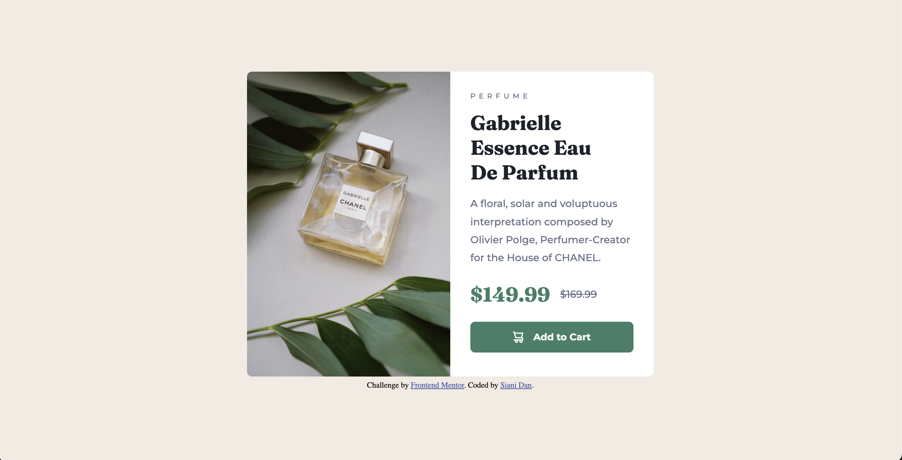

# Frontend Mentor - Product preview card component solution

This is a solution to the [Product preview card component challenge on Frontend Mentor](https://www.frontendmentor.io/challenges/product-preview-card-component-GO7UmttRfa). Frontend Mentor challenges help you improve your coding skills by building realistic projects. 

## Table of contents

- [Overview](#overview)
  - [The challenge](#the-challenge)
  - [Screenshot](#screenshot)
  - [Links](#links)
- [My process](#my-process)
  - [Built with](#built-with)
  - [What I learned](#what-i-learned)
  - [Continued development](#continued-development)
  - [Useful resources](#useful-resources)
- [Author](#author)


## Overview

### The challenge

Users should be able to:

- View the optimal layout depending on their device's screen size
- See hover and focus states for interactive elements

### Screenshot




### Links

- [Solution URL](https://www.frontendmentor.io/solutions/responsive-product-preview-card-using-flexbox-vNWyrk-edq)
- [Live Site URL](https://sianidan.github.io/Product-Preview-Card/)

## My process

### Built with

- Semantic HTML5 markup
- CSS Flexbox
- Mobile-first workflow

### What I learned

The major thing I learned while completing this project was how to switch images based on browser/viewport size using media queries.

Here's one example of what I included in a media query:

```css
@media screen and (max-width:1023px) {
    .imgDesktop { 
        display: none !important;
    }
    .imgMobile { 
        display: block !important;
    }
}
```

### Continued development

Moving forward, I want to keep learning and practicing methods to make each project I build as responsive as possible. Accessibility is a priority of mine, as well as ensuring folks are able to view things that I create whether or not they have access to a desktop.

### Useful resources

- [Changing images for responsive design](https://stackoverflow.com/questions/52172451/media-queries-to-change-image) - The helpful answers to OP's question were the reason I figured out how to switch the main image using media queries.

- [Responsive images cont.](https://css-tricks.com/responsive-images-css/) - This is another really good resource for making images responsive in HTML and CSS. 

- [Responsive typography](https://stevenloria.com/responsive-typography/#:~:text=Responsive%20Typography%20Using%20Modern%20CSS%201%20Recommended%3A%20PostCSS,Typographic%20Scale%20-%20Primer%20on%20modular%20scales%20) - This blog post helped to explain how to make typography on a web page responsive based on the browser size.

## Author

- GitHub - [Siani Dan](https://github.com/sianidan)
- Frontend Mentor - [@yourusername](https://www.frontendmentor.io/profile/sianidan)
- Twitter - [@devbysiani](https://www.twitter.com/devbysiani)

